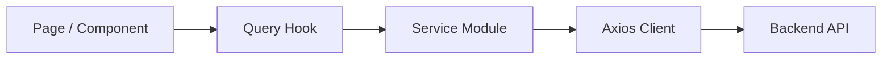

# GoSendeet Project Onboarding

Presenter note: This deck is written in Markdown so it can be pasted into Google Slides, PowerPoint, Pitch, or a docs-based onboarding flow.

---

## Slide 1: Welcome

**GoSendeet frontend onboarding**

- React + TypeScript + Vite logistics platform
- Supports customer, admin, franchise, and public tracking experiences
- Main goal: help a new engineer understand the product surfaces, architecture, and first-week workflow

---

## Slide 2: What This Project Does

GoSendeet is a delivery and logistics web app that lets users:

- Explore the product through a public marketing site
- Get quotes with the cost calculator
- Create and manage shipments
- Track bookings and public dispatch activity
- Operate internal workflows through admin and franchise dashboards

---

## Slide 3: Product Surfaces

The repo contains several distinct experiences in one frontend:

- Public site: `/`, `/about`, `/faq`, `/terms`, `/privacy`
- Booking journey: `/cost-calculator`, `/delivery`, `/checkout`, `/success-page`
- Tracking and visibility: `/track`, `/track-booking`, `/dispatch/:trackingId/:token`
- Auth flows: `/signup`, `/signin`, `/forgot-password`, verification/reset routes, Google OAuth callback
- Customer dashboard: `/dashboard`
- Admin dashboard: `/admin-dashboard`
- Franchise dashboard: `/franchise`

---

## Slide 4: Tech Stack

- React 19
- TypeScript 5
- Vite 6
- React Router 7
- TanStack Query 5
- Axios
- Tailwind CSS 4
- Radix UI
- React Hook Form + Zod
- Google Maps Places API
- Sonner for toasts
- Chatwoot for support widget

---

## Slide 5: Top-Level Structure

```text
src/
  assets/       Images, icons, fonts, GIFs
  components/   Shared UI and reusable feature components
  constants/    Shared constants and reference data
  hooks/        Custom hooks
  layouts/      Shared page shells
  lib/          Route guards, query client, utilities
  pages/        Route-level features grouped by domain
  queries/      TanStack Query hooks
  schema/       Form schemas and types
  services/     API calls and axios clients
  types/        Shared TypeScript types
```

Why it matters:

- `pages/` tells you what the product offers
- `services/` tells you how the frontend talks to the backend
- `queries/` shows how server state is fetched and cached
- `layouts/` and `components/` shape the shared user experience

---

## Slide 6: Route Architecture

`src/App.tsx` is the main route composition layer.

- Public routes render directly
- `PublicRoutes` protects auth screens from logged-in users
- `PrivateRoutes` allows only users with `role === "user"`
- `AdminRoutes` allows `admin` and `super_admin`
- `FranchiseLayout` wraps the franchise area

Key takeaway:

- Role-based routing is simple and session-storage-driven
- Understanding `src/App.tsx` is the fastest way to map the whole product

---

## Slide 7: Layouts and Navigation

The app uses layout wrappers to keep shells consistent:

- `HomePageLayout` for marketing pages
- `DashboardLayout` for user and admin dashboard shells
- `FranchiseLayout` for the franchise experience

In practice:

- The user and admin dashboards are tab-driven inside a shared layout
- The franchise app behaves more like a dedicated operational workspace

---

## Slide 8: Main Functional Areas

**Customer**

- Overview
- Notifications
- Bookings
- Profile settings
- Security

**Admin**

- Profiles
- Orders
- Companies
- Reports
- Notifications
- Settings

**Franchise**

- Dashboard
- Deliveries
- Earnings
- Performance
- Notifications
- Settings

---

## Slide 9: Data Flow



Typical path:

- A page calls a query hook from `src/queries`
- The hook delegates to a service in `src/services`
- The service uses the shared Axios client
- Auth headers are attached automatically for protected requests

---

## Slide 10: API Layer

The API setup is centralized in `src/services/axios.ts`.

- `authApi` is used for auth-related calls
- `api` is used for authenticated application calls
- Bearer token is read from `sessionStorage`
- A `401` clears session state and redirects dashboard users to `/signin`

Why this matters for onboarding:

- If a request fails unexpectedly, start by checking auth token state and route context
- Most new API integrations should follow the existing `services` + `queries` pattern

---

## Slide 11: State and Caching

Server state uses TanStack Query.

- Query client is created in `src/lib/query.ts`
- Default `staleTime` is 12 hours
- Retries are disabled globally

Implication:

- Data can stay “fresh” for a long time unless explicitly refetched
- When debugging stale UI, inspect query keys and manual `refetch` usage first

---

## Slide 12: Auth Model

The app currently relies heavily on `sessionStorage`.

Common values include:

- `authToken`
- `role`
- `userId`
- active dashboard tab selections

What to remember:

- Routing behavior depends on stored role values
- Session state can affect tab selection and page restoration
- Reproducing auth bugs often starts with clearing session storage

---

## Slide 13: External Integrations

- Google Maps Places API
  - Loaded in `src/main.tsx`
  - Used for address and places autocomplete flows
- Chatwoot
  - Injected globally through `src/components/ChatwootWidget`
- OAuth
  - Google login and signup redirect through backend auth endpoints

Operational note:

- Local development needs a valid Maps key and backend access to exercise the full booking flow

---

## Slide 14: Local Setup

Requirements:

- Node.js 20+
- npm 10+
- Backend API access
- Google Maps API key with Places enabled

Environment variables:

```env
VITE_GOOGLE_MAPS_KEY=your_google_maps_key
VITE_SECRET_KEY=your_secret_key
VITE_API_BASE_URL=http://localhost:8080/api/v1
VITE_FRONTEND_BASE_URL=http://localhost:5173
VITE_CHATWOOT_BASE_URL=https://backoffice-customer-support.gosendeet.com
VITE_CHATWOOT_WEBSITE_TOKEN=...
```

---

## Slide 15: Running the App

Install:

```bash
npm install
```

Key scripts:

```bash
npm run dev
npm run build
npm run lint
npm run preview
```

One important nuance:

- `npm run dev` currently runs a build before starting Vite, so startup is slower than a standard Vite dev loop

---

## Slide 16: How To Read the Codebase Fast

Recommended path for new engineers:

1. Start with `src/App.tsx`
2. Open the relevant route entry in `src/pages`
3. Trace data needs through `src/queries`
4. Follow API calls into `src/services`
5. Check shared UI or layout dependencies in `src/components` and `src/layouts`

This flow helps you answer:

- Where does the UI live?
- Where does the data come from?
- What role can access this page?

---

## Slide 17: Working Conventions Visible in the Repo

- Feature-first page organization
- Shared primitives in `src/components/ui`
- Forms commonly pair React Hook Form with Zod schemas
- UI behavior often uses tab state persisted in session storage
- Route guards are lightweight and live in `src/lib`

This means:

- New features should usually extend an existing feature area, not create a parallel structure
- Consistency matters more than introducing a new pattern per screen

---

## Slide 18: First Week Checklist

- Run the app locally with working env variables
- Click through the public site, quote flow, tracking flow, and auth flow
- Log in as a user and inspect the customer dashboard
- Log in as an admin and inspect the admin tabs
- Review one franchise workflow end-to-end
- Read `README.md`, `src/App.tsx`, `src/services/axios.ts`, and one query/service pair

---

## Slide 19: Common Debugging Entry Points

If something breaks, start here:

- Routing issue: `src/App.tsx`, `src/lib/PrivateRoutes.tsx`, `src/lib/AdminRoutes.tsx`
- Data-fetching issue: `src/queries/*`, `src/services/*`
- Auth/session issue: `sessionStorage`, Axios interceptors
- Location or address issue: `src/main.tsx`, Google Maps hooks
- Shared UI issue: `src/components/ui/*` or dashboard navigation components

---

## Slide 20: Risks and Current Observations

A few repo-level things a new engineer should notice early:

- Large multi-surface app inside one frontend can make ownership boundaries fuzzy
- Session-storage-based auth and tab state are simple, but easy to desync during debugging
- Very long query `staleTime` can hide backend changes during development
- The `dev` script includes a build step, which may slow iteration

These are not blockers, just useful context for realistic expectations

---

## Slide 21: Suggested Team Talking Points

Use this deck as a starting point for a live onboarding session:

- Which product surfaces are most business-critical today?
- Which dashboard area changes most frequently?
- What backend environments should engineers use?
- Which user roles and test accounts are available?
- What parts of the codebase need the most cleanup or documentation?

---

## Slide 22: Closing

**What success looks like after onboarding**

- A new engineer can boot the app locally
- They can explain the route structure and product surfaces
- They know how data flows from page to backend
- They know where to add a new screen, service, or query
- They understand the biggest practical debugging entry points

End with: “Start from the route, trace the data, and let the product surface guide your exploration.”
